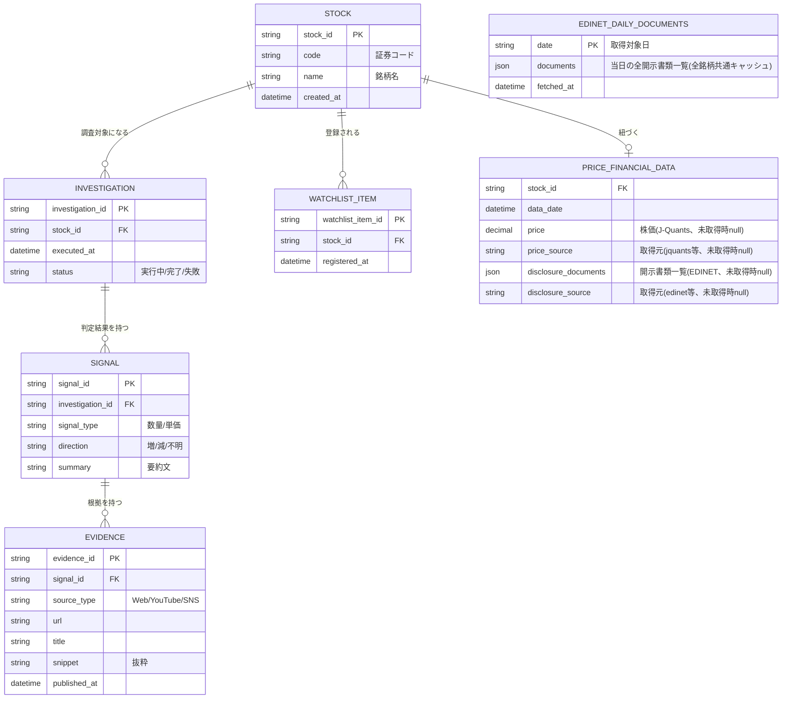
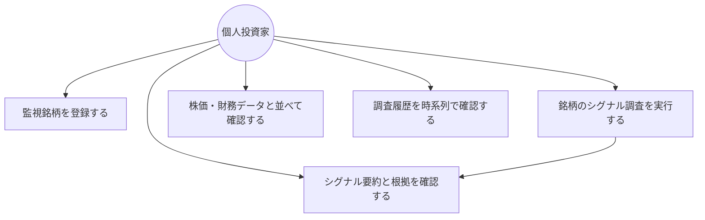
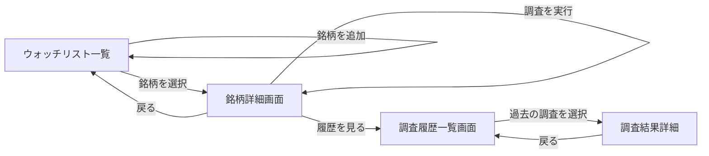

# functional-design.md - 機能設計書

本ドキュメントは `docs/product-requirements.md` で定義したプロダクト要求を、機能単位のアーキテクチャ・データモデル・画面構成・APIとして具体化するものである。技術スタックの選定は `docs/architecture.md` で扱うため、本書では技術非依存な論理設計を記述する。

## 1. システム構成図

本アプリは大きく「フロントエンド(閲覧・操作)」「バックエンド(調査オーケストレーションとデータ管理)」「外部情報源」の3層で構成する。

```mermaid
graph TD
    subgraph Client[クライアント]
        UI[Webフロントエンド<br/>レスポンシブUI]
    end

    subgraph Server[バックエンド]
        API[アプリケーションAPI]
        ORCH[調査オーケストレーター]
        STORE[(データストア)]
    end

    subgraph External[外部情報源・外部データ]
        WEBSEARCH[Web検索API]
        YOUTUBE[YouTube検索/データAPI]
        SNS[SNS API]
        JQUANTS[J-Quants API<br/>株価データ・無料登録]
        EDINET[EDINET API<br/>開示書類一覧・無料登録]
    end

    UI -->|銘柄指定・調査依頼| API
    API --> ORCH
    ORCH -->|検索クエリ| WEBSEARCH
    ORCH -->|検索クエリ| YOUTUBE
    ORCH -->|検索クエリ| SNS
    ORCH -->|判定結果・根拠を保存| STORE
    API -->|株価取得| JQUANTS
    API -->|開示書類一覧取得(日付単位・キャッシュ)| EDINET
    API -->|調査結果・履歴取得| STORE
    API -->|表示データ| UI
```

- 株価・開示情報は、証券会社の口座を持たないユーザーでも利用できる無料の公的データソース(J-Quants API・EDINET API)から取得する。両APIとも認証情報は無料登録で取得できるが、未設定の場合は「未取得」として表示しアプリの動作は継続する(連携方式・制約の詳細は `architecture.md` で確定する)。
- Web/YouTube/SNSの調査は「半自動調査」であり、ユーザーが銘柄を指定した契機で実行される。

## 2. 機能ごとのアーキテクチャ

### 2.1 銘柄指定によるシグナル調査機能

1. ユーザーがウォッチリストから銘柄を選択、または銘柄名/証券コードを指定する。
2. バックエンドの調査オーケストレーターが、当該銘柄に対して以下を実行する。
   - Web検索: 値上げ・値下げ・売れ行き等に関するキーワードで検索
   - YouTube検索: レビュー動画・決算解説動画等を検索
   - SNS検索: 口コミ・言及を検索
3. 検索結果から「数量増減」「単価増減」のシグナル候補を抽出し、判定(増/減/不明)・要約・根拠リンクとともに調査結果として保存する。
4. 調査は非同期処理とし、完了後にユーザーへ結果を表示する(処理時間が数秒〜数十秒に及ぶ可能性があるため)。

### 2.2 調査結果の要約表示

- 銘柄ごとに「数量↑/↓/不明」「単価↑/↓/不明」を判定ラベルとして表示する。
- 各判定には根拠情報(出典タイトル・リンク・抜粋・情報源種別・公開日時)を1件以上紐づけて表示する。
- 根拠が得られなかった場合は「不明(根拠なし)」として明示する。

### 2.3 株価・財務データ表示

- J-Quants APIから取得した直近の株価(終値)と、EDINET APIから取得した直近の開示書類一覧(有価証券報告書・決算短信等のタイトル・提出日時・リンク)を、銘柄コードで紐づけて表示する。
- ユーザーが「データを更新」を実行した契機で取得する(調査実行とは独立した操作)。
- いずれかのAPI認証情報が未設定、または取得に失敗した場合は「未取得」であることを明示し、他の情報の表示・操作は妨げない。
- シグナル要約と同一画面(同一ビュー)に並べて表示し、定性・定量を並列比較できるようにする。

### 2.4 調査履歴の蓄積・時系列比較

- 調査を実行するたびに調査結果をレコードとして保存し、上書きしない(履歴として蓄積)。
- 銘柄ごとに調査履歴を時系列一覧表示し、過去の判定・根拠を遡って確認できるようにする。

### 2.5 スマホ対応のレスポンシブUI

- ウォッチリスト一覧・銘柄詳細・調査履歴の各画面は、スマートフォンの画面幅でも崩れずに表示・操作できるレイアウトとする。
- 詳細は `architecture.md` のパフォーマンス要件・技術制約と合わせて定める。

## 3. データモデル定義(ER図)



- `PRICE_FINANCIAL_DATA` はJ-Quants API(株価)・EDINET API(開示書類一覧)から取得した結果を保持する論理エンティティである。いずれか一方、または両方が未取得(認証情報未設定・取得失敗)の場合は該当フィールドが空になる。
- `EDINET_DAILY_DOCUMENTS` はEDINETの日付単位の書類一覧を全銘柄で共有キャッシュするためのエンティティであり、`STOCK` とは直接の関連を持たない(取得時に `secCode` で絞り込んで利用する)。
- `INVESTIGATION` は調査1回分の実行単位、`SIGNAL` はその調査で得られた「数量」「単価」それぞれの判定、`EVIDENCE` は判定の根拠となった個々の情報源を表す。

## 4. コンポーネント設計

### 4.1 フロントエンド

| コンポーネント | 役割 |
| --- | --- |
| WatchlistView | 監視銘柄一覧の表示・銘柄の追加/削除 |
| StockDetailView | 銘柄詳細(最新シグナル要約 + 株価・財務データ) |
| InvestigationHistoryView | 調査履歴の時系列一覧・過去判定の確認 |
| SignalSummaryCard | 「数量↑/↓」「単価↑/↓」の判定と根拠リンクの表示 |
| InvestigationTriggerControl | 銘柄指定・調査実行の操作 |
| MarketDataSyncControl | 株価・開示書類データの更新操作 |

### 4.2 バックエンド

| コンポーネント | 役割 |
| --- | --- |
| WatchlistService | ウォッチリストの登録・取得・削除 |
| InvestigationOrchestrator | Web/YouTube/SNS調査の実行制御、非同期処理管理 |
| SignalExtractionService | 検索結果からのシグナル判定・要約生成 |
| JQuantsClient | J-Quants APIによる株価データ取得(未設定時はnull) |
| EdinetClient | EDINET APIによる開示書類一覧取得。日付単位の全銘柄共有キャッシュを持ち、証券コードで絞り込む |
| MarketDataSyncService | JQuantsClient・EdinetClientの呼び出しと結果の永続化 |
| InvestigationHistoryService | 調査結果・履歴の永続化と取得 |

## 5. ユースケース図



## 6. 画面遷移図



## 7. ワイヤフレーム(概要)

### 7.1 銘柄詳細画面(スマホ幅を想定した縦積みレイアウト)

```
+-------------------------------+
| < 戻る       銘柄名(証券コード) |
+-------------------------------+
| [ 調査を実行 ] ボタン           |
+-------------------------------+
| シグナル要約                    |
|  数量: ↑ 増加傾向               |
|   根拠: [出典1] [出典2]         |
|  単価: → 不明                  |
|   根拠: なし                    |
+-------------------------------+
| 株価・財務データ [更新] ボタン    |
|  株価: xxx円(J-Quants)         |
|  開示書類: [有報 2026/xx] ...   |
+-------------------------------+
| [ 調査履歴を見る ] リンク         |
+-------------------------------+
```

- PC幅では「シグナル要約」と「株価・財務データ」を左右2カラムで並べて表示し、定性・定量情報を同一視野で比較できるようにする。

## 8. API設計

以下はバックエンドが提供する論理API(パス・詳細な入出力形式は `architecture.md` の技術選定後に確定する)。

| API | メソッド | 概要 |
| --- | --- | --- |
| `/watchlist` | GET | 監視銘柄一覧を取得 |
| `/watchlist` | POST | 監視銘柄を追加 |
| `/watchlist/{stockId}` | DELETE | 監視銘柄を削除 |
| `/stocks/{stockId}` | GET | 銘柄の最新シグナル要約 + 株価・財務データを取得 |
| `/stocks/{stockId}/investigations` | POST | 当該銘柄のシグナル調査を実行(非同期) |
| `/stocks/{stockId}/investigations` | GET | 当該銘柄の調査履歴一覧を取得(時系列) |
| `/investigations/{investigationId}` | GET | 調査結果詳細(シグナル・根拠一覧)を取得 |
| `/stocks/{stockId}/market-data` | POST | J-Quants(株価)・EDINET(開示書類一覧)からデータを取得・更新 |

## 9. 影響範囲・前提

- 本書は初回実装前の設計であり、実装時の技術的制約により詳細が変わる場合は `architecture.md` および本書を更新する。
- 株価・開示情報の取得はJ-Quants API・EDINET APIを用いる(`.steering/20260905-market-data-source/` で証券会社口座を前提としない方式に変更)。EDINETの検索制約(日付単位走査・日次キャッシュ)は `architecture.md` の技術的制約に明記する。
